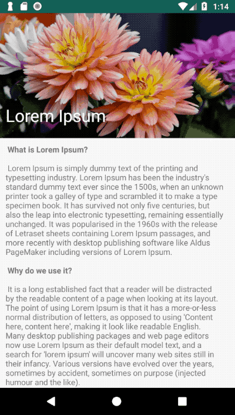

# MotionLayout example - parallax scrolling
An android application that implements parallax scrolling with MotionLayout

## Getting Started
This sample uses the Gradle build system. To build this project, use the "gradlew build" command or use "Import Project" in Android Studio.

## Demo

